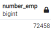
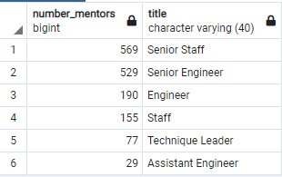

# Module 7 Challenge: Pewlett-Hackard-Analysis

## Overview
The management at Pewlett-Hackard (PH) is concerned about the number of upcoming retirements as their workforce ages, terming the expected surge in retirement the "silver tsunami."  To best plan for the retirement, managers have asked for a count of employees within their departments. A potential solution to softening the impact is to offer training to the employess that are most likley to retire within the next year, training them to be mentors to incoming employees on a part-time basis. The purpose of this report is to provide the needed information to managers at Pewlett-Hackard so taht they may plan for the "silver tsunami" of retirements.

Specifically, managers would like to know the number of retiring employees within each job title as well as list of employees that may be eligible for the mentorship program.

## Results

### Number of Retiring Employees by Job Title.

Overall, the total number of current employees that may be retiring from PH is 72,458.  The following table shows the number of employees retiring by job title:

### Number of Employees Eligible for the Mentorship Program

Overall, the total number of current employees that may be eligible for the Mentorship Program is 1,549.  The following table show the number of emplyess eliglble for the mentorship program by job title.

