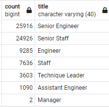
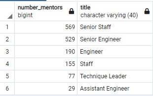
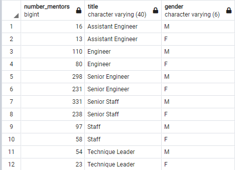

# Module 7 Challenge: Pewlett-Hackard-Analysis

## Overview
The management at Pewlett-Hackard (PH) is concerned about the number of upcoming retirements as their workforce ages, terming the expected surge in retirement the "silver tsunami."  To best plan for the retirement, managers have asked for a count of employees within their departments. A potential solution to softening the impact is to offer training to the employess that are most likley to retire within the next year, training them to be mentors to incoming employees on a part-time basis. The purpose of this report is to provide the needed information to managers at Pewlett-Hackard so that they may plan for the "silver tsunami" of retirements.

Specifically, managers would like to know the number of retiring employees within each job title as well as list of employees that may be eligible for the mentorship program.

## Results

### Number of Retiring Employees by Job Title.

Overall, the total number of current employees that may be retiring from PH is 72,458.  The following table shows the number of employees retiring by job title:

### Number of Employees Eligible for the Mentorship Program

Overall, the total number of current employees that may be eligible for the Mentorship Program is 1,549.  The following table show the number of emplyees eliglble for the mentorship program by job title.

### Main Points
The major findings of this analysis are:
    - A large number of employees will be retiring in the upcoming years (72,458)
    - The two job titles that comprise the largest number of reitrees are Senior Engineers and Senior Staff.
    - There is a fairly large number of current employees that would be eligible for the Mentoring Program (1,549)
    - The number of potential employess eligible for the Mentoring Program, which will be the first to retire, represent a small proportion (2%) of the overall upcoming retirees in the next few years. This is good news as they will be able to proactively train new employees to relpace retires.
    - There are no retiring managers that are currently eligible for the Mentorship Program.

## Summary
Management has had concerns about the upcoming "silver tsunami" of retirees, and their concerns are justified, as there is a significant number of individuals that will be retiring. Nevertheless, the idea of a Mentoring Program has the potential to reduce the impact of the wave. There are sufficient numbers of current employees who will be eligible to become mentors to new employees for all the job titles, with the exception of Managers. Upper management should be aware of the lack of potential mentors within management and may need to recruit individuals from within the departmental ranks for training prior to retirement of the current managers.

## Additional insights

Management may wish to consider gender diversity when creating their mentoshop program. The following table is a summary of employees eligible for the Mentorship Program by gender. Given the large number of retirees eligible for the mentorship program, management should not have a problem selecting a diverse pool of mentors.

